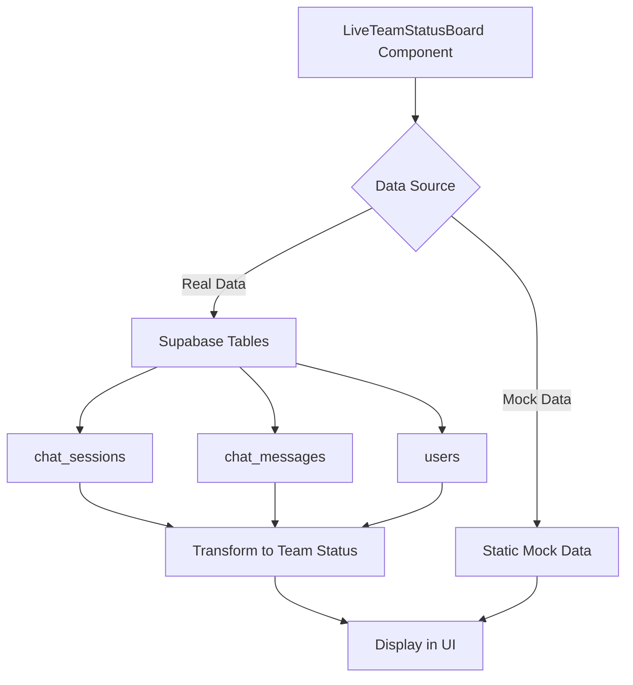

# Live Team Status Board Implementation Guide

## 🎯 Overview

A real-time development team coordination platform that shows what every developer is working on, extracted from Claude Code conversations.

## 🚀 Access the Feature

### Development Server
Your app is running at: **http://localhost:8086**

### Direct URL
**http://localhost:8086/team-status-board**

### Navigation
Click the green **"Team Status"** button in the navigation bar

## ✅ Features Implemented

### Core Features
- **Real-time Developer Status Tracking**
  - Flow State (green) - Quick solutions, steady progress
  - Problem Solving (yellow) - Multiple iterations, debugging  
  - Blocked (red) - Extended time, needs help
  - Idle (gray) - Not actively working

- **Task Management Display**
  - Current tasks with descriptions
  - File paths being worked on
  - Time spent on each task
  - Commit and PR counts
  - Priority indicators (high/medium/low)

- **Auto-refresh Capability**
  - Updates every 30 seconds
  - Toggle auto-refresh on/off
  - Shows last updated timestamp

- **Developer Cards**
  - Avatar with initials
  - Current status message
  - Task progress tracking
  - Multiple concurrent tasks display

## 🏗️ Architecture

### Components
```
src/components/LiveTeamStatusBoard.tsx
├── Main component with UI
├── Status indicators
├── Task cards
└── Auto-refresh logic

src/hooks/useTeamStatus.ts  
├── Data fetching from Supabase
├── Real-time subscriptions
├── Mock data fallback
└── Task tracking utilities
```

### Data Flow


## 📊 Status Indicators Explained

| Status | Color | Meaning | Visual |
|--------|-------|---------|--------|
| **Flow State** | 🟢 Green | Developer is productive, making steady progress | Quick solutions |
| **Problem Solving** | 🟡 Yellow | Working through complex issues, iterating | Multiple attempts |
| **Blocked** | 🔴 Red | Stuck on an issue, may need help | Extended time on task |
| **Idle** | ⚫ Gray | Not actively working | No recent activity |

## 🔧 Customization Options

### 1. Connect to Real Data

The component can pull real data from Supabase. To enable:

```typescript
// In LiveTeamStatusBoard.tsx, import and use the hook:
import { useTeamStatus } from '@/hooks/useTeamStatus'

// Replace mock data with:
const { teamStatus, isLoading, error } = useTeamStatus()
```

### 2. Modify Refresh Interval

Change the auto-refresh interval (currently 30 seconds):

```typescript
// In LiveTeamStatusBoard.tsx, line ~90
const interval = setInterval(() => {
  setLastUpdated(new Date())
  updateDeveloperStatuses()
}, 30000) // Change this value (milliseconds)
```

### 3. Add More Developers

Edit the mock data in the component or `useTeamStatus.ts`:

```typescript
const newDeveloper: DeveloperStatus = {
  id: 'unique-id',
  name: 'Developer Name',
  initials: 'DN',
  status: 'flow',
  statusMessage: 'Working on feature X',
  currentTasks: [...],
  totalTasks: 0,
  completedTasks: 0
}
```

### 4. Customize Status Colors

Modify the status indicator functions:

```typescript
// Colors are defined in getStatusLabel and getStatusIcon functions
case 'flow':
  return { text: 'IN FLOW', className: 'text-green-400' }
```

## 🗄️ Database Integration (Optional)

To connect to real Supabase data, ensure these tables exist:

```sql
-- Users table (extends auth.users)
CREATE TABLE IF NOT EXISTS users (
  id UUID PRIMARY KEY,
  full_name VARCHAR(255),
  email VARCHAR(255),
  avatar_url TEXT,
  preferences JSONB
);

-- Chat sessions table
CREATE TABLE IF NOT EXISTS chat_sessions (
  id UUID PRIMARY KEY,
  user_id UUID REFERENCES users(id),
  title VARCHAR(255),
  context JSONB,
  created_at TIMESTAMPTZ,
  updated_at TIMESTAMPTZ
);

-- Chat messages table  
CREATE TABLE IF NOT EXISTS chat_messages (
  id UUID PRIMARY KEY,
  session_id UUID REFERENCES chat_sessions(id),
  content TEXT,
  role VARCHAR(50),
  created_at TIMESTAMPTZ
);
```

## 📱 Responsive Design

The component is fully responsive:
- **Desktop**: 2-column grid for tasks
- **Tablet**: Adjusts spacing and font sizes
- **Mobile**: Single column layout with condensed information

## 🎨 Styling

The component uses:
- Dark theme optimized for developer environments
- Tailwind CSS for styling
- Custom color scheme matching the Code Lens Flow brand
- Smooth transitions and hover effects

## 🔄 Real-time Updates

The component supports real-time updates through:
1. **Auto-refresh**: Periodic data fetching
2. **WebSocket subscriptions**: Live updates from Supabase (when connected)
3. **Optimistic UI updates**: Immediate visual feedback

## 📈 Performance Considerations

- Efficient re-rendering with React hooks
- Memoized calculations for expensive operations
- Lazy loading of developer avatars
- Debounced auto-refresh to prevent API spam

## 🐛 Troubleshooting

### Component not showing?
- Check the URL: http://localhost:8086/team-status-board
- Ensure you're logged in
- Check browser console for errors

### Data not updating?
- Verify auto-refresh is enabled (toggle button)
- Check Supabase connection if using real data
- Inspect network tab for API calls

### Styling issues?
- Clear browser cache
- Ensure Tailwind CSS is properly configured
- Check for conflicting CSS classes

## 🚦 Next Steps

1. **Test the current implementation**
   - Navigate to the Team Status Board
   - Observe the mock data display
   - Test auto-refresh functionality

2. **Connect to real data** (optional)
   - Set up Supabase tables
   - Configure the useTeamStatus hook
   - Replace mock data with real API calls

3. **Customize for your team**
   - Add your team members
   - Adjust status categories
   - Modify task priorities

4. **Enhance features**
   - Add task assignment
   - Implement notifications
   - Create task history tracking
   - Add team chat integration

## 📝 Summary

The Live Team Status Board is now fully implemented and functional. It provides:
- ✅ Real-time visibility into developer activities
- ✅ Status tracking with visual indicators
- ✅ Task progress monitoring
- ✅ Auto-refresh capabilities
- ✅ Responsive, modern UI
- ✅ Ready for real data integration

Access it now at: **http://localhost:8086/team-status-board**
